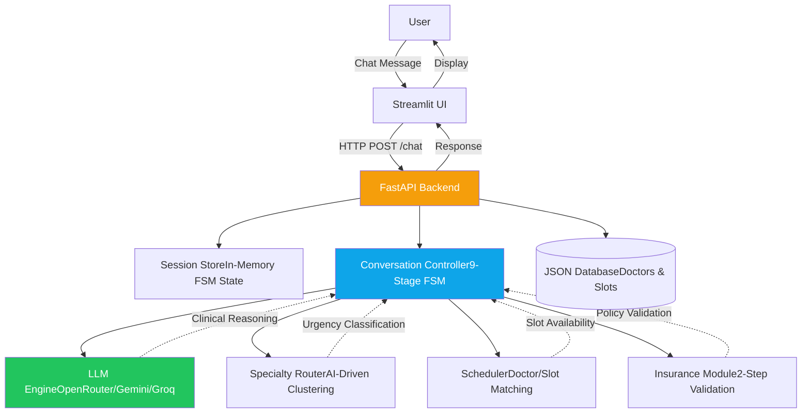
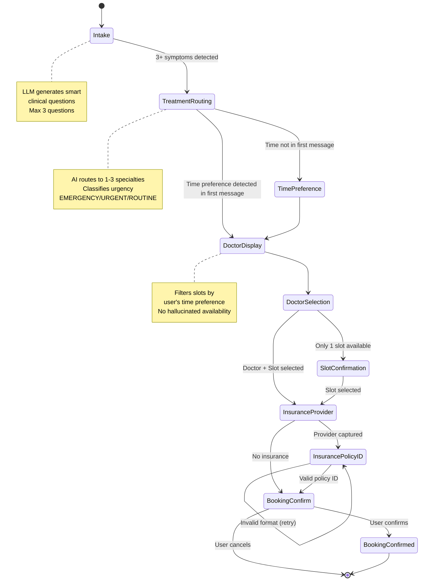
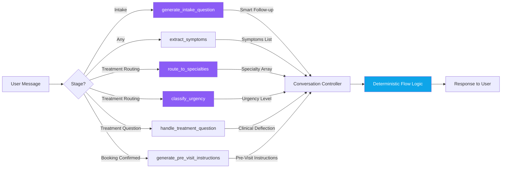

#🦷 Clinical Dental Conversational Booking Assistant

AI-driven dental triage and appointment scheduling system with multi-specialty routing, smart clinical intake, and deterministic FSM-based conversation control.

Built to demonstrate production-grade conversational AI design — not a basic chatbot.

---

## 🎯 Project Overview

This system demonstrates healthtech-grade conversational booking with:
- **Clinical reasoning** via LLM (not just keyword matching)
- **Deterministic flow control** via Finite State Machine
- **Multi-specialty routing** (Endodontics, Oral Surgery, Orthodontics, Periodontics, Restorative)
- **Smart intake** (no repeated questions, context-aware follow-ups)
- **Structured data capture** (2-step insurance validation)
- **Zero permission prompts** ("would you like to book?" is banned)

---

## 🏗️ System Architecture


---

## 📊 Conversation Flow (FSM)


---

## 🧠 LLM Module Architecture


---

## 📁 Project Structure
```
dental-booking-assistant/
├── app/
│   ├── __init__.py
│   ├── main.py                      # FastAPI app + routes
│   ├── models.py                    # Pydantic schemas
│   ├── session_store.py             # In-memory FSM state
│   ├── conversation_controller.py   # 9-stage FSM brain
│   ├── llm_engine.py                # LLM API calls (6 modules)
│   ├── specialty_router.py          # Symptom clustering logic
│   ├── scheduler.py                 # Doctor/slot matching + filtering
│   ├── insurance_module.py          # 2-step validation
│   └── data/
│       ├── doctors.json             # 8 doctors, 5 specialties
│       └── slots.json               # 28 appointment slots
├── streamlit_app.py                 # Chat UI
├── requirements.txt
├── .env                             # API keys
└── README.md
```

---

## ✅ Key Features (Spec Compliance)

### 1. Clinical Intake Reasoning
- **LLM-driven question selection** — not hardcoded decision trees
- **Context-aware** — reads full conversation history before asking
- **No repetition** — never asks about symptoms already stated
- **Early termination** — stops at 3+ symptoms or after 3 questions
- **Rich first message detection** — skips intake if 4+ symptoms in first message

### 2. Multi-Specialty Routing
**Supported Specialties:**
- 🦷 **Endodontics** — Root canals, pulp issues, night pain, abscess
- 🔪 **Oral Surgery** — Extractions, impacted wisdom teeth, trauma
- 🦷 **Orthodontics** — Braces, aligners, bite alignment
- 🦷 **Periodontics** — Gum disease, recession, bleeding gums
- 🦷 **Restorative Dentistry** — Crowns, fillings, broken teeth

**Routing Logic:**
- AI-driven symptom clustering (not keyword matching)
- Supports multiple specialties per patient
- Urgency classification: EMERGENCY / URGENT / ROUTINE

### 3. Smart Time Preference Handling
- **Auto-detection** from first message if mentioned
- **No re-asking** if already stated
- **Flexible parsing** — "Wed", "Wednesday morning", "9am" all work
- **Slot filtering** — only shows matching availability
- **Guard against hallucination** — no Sunday slots if not in database

### 4. Deterministic Flow Control
**9-Stage FSM:**
```
Intake → Treatment Routing → Time Preference → Doctor Display → 
Doctor Selection → Insurance Provider → Insurance Policy ID → 
Slot Confirmation → Booking Confirmed
```

**Stage Transitions:**
- Controlled by `conversation_controller.py`
- State stored in `session_store.py`
- No ambiguous paths

### 5. Insurance Workflow (2-Step Validation)
**Step 1: Provider Name**
- Handles filler phrases ("yes I have Delta Dental" → "Delta Dental")
- Skip support ("no insurance", "skip", "just book it")

**Step 2: Policy ID Validation**
- Format validation (5-20 chars, alphanumeric, must contain digits)
- Rejects pure text ("helloworld") or random strings
- Accepts standard formats (DDL-48291A, UCH-29301)

### 6. No Permission Prompts
**Banned phrases:**
- "Would you like to book an appointment?"
- "Do you want to see doctors?"
- "Should I schedule?"

**Instead:** System recommends next clinical step directly.

### 7. Pre-Visit Instructions
- Generated by LLM based on specialty
- Clinical and actionable
- Shown after booking confirmation

---

## 🧪 Test Scenarios

### Scenario 1: Everything-in-One-Message
**Input:**
```
I have severe night pain, hot and cold sensitivity, an impacted wisdom 
tooth, and I want aligners before my wedding in 6 months. I can only do 
Tuesday evenings or Saturday.
```

**Expected Behavior:**
- ✅ Zero intake questions asked
- ✅ 3 specialties routed (Endodontics + Oral Surgery + Orthodontics)
- ✅ Time preference auto-captured
- ✅ Doctor list shown with Tuesday evening + Saturday slots only
- ✅ One response

---

### Scenario 2: Treatment Question Mid-Flow
**Input:**
```
MSG 1: I have severe tooth pain and swelling
MSG 2: Saturday morning
MSG 3: Wait, what treatment will I need?
```

**Expected Behavior:**
- ✅ Clinical deflection ("I cannot advise on treatment...")
- ✅ Specialty mentioned
- ✅ Doctor list shown again
- ✅ No "would you like to book?" prompt

---

### Scenario 3: Invalid Insurance ID
**Input:**
```
MSG 5: (Policy ID stage) "helloworld"
```

**Expected Behavior:**
- ✅ Rejection message ("doesn't look like valid ID")
- ✅ Explanation of valid format
- ✅ Re-prompt for correct ID

---

### Scenario 4: Doctor Name Variations
All of these find **Dr. Arjun Mehta:**
- `Dr. Mehta`
- `Mehta`
- `dr mehta`
- `DR.MEHTA`
- `Arjun`

---

### Scenario 5: Auto-Slot Selection
**Input:**
```
MSG 3: Dr. Meera Pillai (only 1 Monday slot exists)
```

**Expected Behavior:**
- ✅ Slot auto-selected (Monday 9:30 AM)
- ✅ Insurance question asked immediately
- ✅ No unnecessary slot selection step

---

## 🚀 Setup & Installation

### Prerequisites
- Python 3.10+
- OpenRouter / Google Gemini / Groq API key

### Installation

1. **Clone repository:**
```bash
git clone 
cd dental-booking-assistant
```

2. **Create virtual environment:**
```bash
python -m venv venv
source venv/bin/activate  # On Windows: venv\Scripts\activate
```

3. **Install dependencies:**
```bash
pip install -r requirements.txt
```

4. **Set API key in `.env`:**
```env
# Option 1: OpenRouter
OPENROUTER_API_KEY=your_key_here

# Option 2: Google Gemini
GEMINI_API_KEY=your_key_here

# Option 3: Groq
GROQ_API_KEY=your_key_here
```

5. **Run FastAPI backend:**
```bash
uvicorn app.main:app --reload
```

6. **Run Streamlit UI (separate terminal):**
```bash
streamlit run streamlit_app.py
```

7. **Access:**
- UI: http://localhost:8501
- API Docs: http://localhost:8000/docs

---

## 🌐 Deployment (Ngrok)

### Expose to Internet

1. **Install ngrok:** https://ngrok.com/download

2. **Authenticate:**
```bash
ngrok config add-authtoken YOUR_TOKEN
```

3. **Expose Streamlit:**
```bash
ngrok http 8501
```

4. **Update `streamlit_app.py`:**
```python
API_BASE = "http://127.0.0.1:8000"  # Local backend
```

5. **Share ngrok URL with reviewer:**
```
https://your-subdomain.ngrok-free.app
```

---

## 📡 API Reference

### POST `/session/new`
Create new conversation session.

**Response:**
```json
{
  "session_id": "uuid",
  "message": "Session created"
}
```

---

### POST `/chat`
Main chat endpoint.

**Request:**
```json
{
  "session_id": "uuid",
  "user_message": "I have tooth pain"
}
```

**Response:**
```json
{
  "session_id": "uuid",
  "assistant_message": "When did the pain start?",
  "current_stage": "intake",
  "booking_complete": false
}
```

---

### GET `/session/{session_id}`
Inspect session state (debugging).

**Response:**
```json
{
  "session_id": "uuid",
  "stage": "doctor_selection",
  "collected_symptoms": ["severe night pain", "cold sensitivity"],
  "routed_specialties": ["Endodontics"],
  "time_preference": "Saturday morning",
  "booking": {
    "doctor_name": "Dr. Priya Sharma",
    "slot_day": "Saturday",
    "slot_time": "10:00 AM",
    "insurance": {
      "provider": "Delta Dental",
      "policy_id": "DDL-48291A"
    }
  }
}
```

---

### GET `/sessions`
List all active sessions.

---

### DELETE `/session/{session_id}/reset`
Reset session to intake stage.

---

## 🔧 Tech Stack

| Component | Technology |
|-----------|------------|
| Backend Framework | FastAPI |
| Frontend UI | Streamlit |
| LLM API | OpenRouter / Google Gemini / Groq |
| State Management | In-memory (production: Redis) |
| Database | JSON files (production: PostgreSQL) |
| Validation | Pydantic v2 |
| HTTP Client | httpx |

---

## 🎯 Design Decisions

### Why FSM over Pure LLM?
- **Deterministic flow** — no conversation loops
- **State persistence** — survives across messages
- **Booking reliability** — critical data not lost
- **Hybrid approach** — LLM for reasoning, FSM for control

### Why In-Memory State?
- **Prototype simplicity** — no external dependencies
- **Production path** — Redis drop-in replacement ready

### Why JSON Database?
- **Seed data clarity** — easy to inspect/modify
- **Production path** — PostgreSQL migration straightforward

---

## 📝 Known Limitations

### Architectural Trade-offs
| Limitation | Reason | Production Solution |
|------------|--------|---------------------|
| In-memory state resets on restart | Prototype simplicity | Redis persistence |
| JSON DB not concurrent-safe | Single-user demo | PostgreSQL with transactions |
| No authentication | Out of scope | OAuth2 + JWT |
| Free-tier LLM rate limits | Cost optimization | Paid API tier |

---

## 🧠 LLM Prompting Strategy

### Module 1: Intake Question Generation
**Prompt Strategy:**
- System role: "Clinical dental triage assistant"
- Context injection: Full conversation history + collected symptoms
- Constraint: "NEVER ask about symptoms already mentioned"
- Termination signal: "INTAKE_COMPLETE" when sufficient data

### Module 2: Symptom Extraction
**Prompt Strategy:**
- Output format: Comma-separated list (structured)
- Guard against junk: Filters temporal phrases ("yesterday", "started")
- Handles lists: Supports both CSV and bullet-point LLM outputs

### Module 3: Specialty Routing
**Prompt Strategy:**
- Explicit specialty definitions in system prompt
- JSON output format enforced
- Fallback: Keyword matching if LLM fails

### Module 4: Urgency Classification
**Prompt Strategy:**
- Enum output: EMERGENCY / URGENT / ROUTINE
- Clinical criteria explicit in prompt
- Fallback: Default to URGENT on parse failure

---

## 👤 Author

**Ratish Oberoi**

Project built to demonstrate production-grade conversational AI design for healthtech applications.

Spec compliance: Clinical Dental Conversational Booking Assistant (Reviewer-Grade)

---

## 📄 License

This is a portfolio/demonstration project.

---